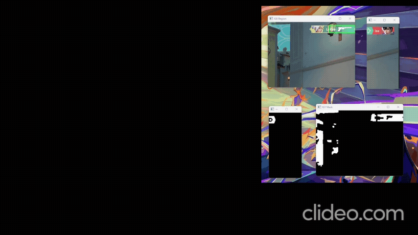

# Valorant Killfeed Parser (OCR)

## Kill/Death Detection Demo:
https://drive.google.com/file/d/1NUj_Ucyr-1mkolp1d6s4uZM7t7HWL4Ad/view?usp=drive_link



## Overview
This project parses the **on-screen killfeed** using:
- **Screen capture (MSS)**
- **Image processing (OpenCV)**
- **OCR** (Tesseract and/or EasyOCR)

It extracts **killer → victim** for each highlighted row (green/red team styling), logs events to JSON, and can update a small **text file** for OBS or other tools. It does **not** track your personal K/D or match “you” to nicknames.

---

## Why This Project Exists
The Valorant API does **not** allow real-time killfeed access during gameplay. This tool reads the same UI you see, locally.

### What it does
- Detects killfeed rows and parses **killer** and **victim** names
- Tags row color (`green` / `red`) for team-style bars
- Writes `killfeed_events.json` and optional `overlay_stats.txt`
- Optional full-screen captures when new rows appear (live mode)

---

## Components
### **1. MSS**
Captures the killfeed region with low overhead.

### **2. OpenCV**
HSV masks, contours, row crops for OCR.

### **3. Tesseract / EasyOCR**
Text recognition on name regions.

### **4. Python logic**
Deduplication of repeated killer→victim pairs within a short window, timing logs.

---

## How it works (high level)
1. Capture `REGION_KILLFEED` (full killfeed column).
2. Find green/red row highlights.
3. OCR each row → **killer**, **victim** (and raw left/right strings).
4. Append new events to the log and refresh output files.

---

## Installation
1. Install Python 3.9+
2. Install dependencies:
```bash
pip install opencv-python numpy mss pytesseract
```

If you install **EasyOCR**, it may pull in `opencv-python-headless`, which **breaks `imshow` preview windows**. Either remove headless and keep GUI OpenCV:

```bash
pip uninstall opencv-python-headless
pip install opencv-python
```

…or run live mode without windows: `python valorant_killfeed_tracker.py --no-gui --ocr-engine easyocr` (the script also auto-detects missing GUI and falls back to headless).

3. Install Tesseract OCR:  
Download for Windows: https://github.com/tesseract-ocr/tesseract

4. Edit the killfeed region in the script if needed (or pass `--killfeed-rect TOP,LEFT,WIDTH,HEIGHT` once per run). **Use a short height** so the crop is only the killfeed strip: a tall box also captures the **combat report / death recap** modal and OCR will invent bogus rows from player names there.
```python
REGION_KILLFEED = {"top": 80, "left": 1300, "width": 600, "height": 180}
```

### GPU acceleration (faster EasyOCR)

**Tesseract always runs on CPU.** GPU helps only when you use **`--ocr-engine easyocr`** or **`both`** (EasyOCR part).

1. **NVIDIA GPU** + up-to-date driver (GeForce / RTX / etc.).
2. Install **PyTorch built with CUDA** (the default `pip install torch` from PyPI is often **CPU-only** on Windows).

   - Open [PyTorch Get Started](https://pytorch.org/get-started/locally/), choose *Stable*, *Windows*, *Pip*, your **CUDA** version, then run the command it shows (usually `pip install torch torchvision ...` with a CUDA index URL).

   - If you already installed CPU PyTorch, reinstall:

```bash
pip uninstall torch torchvision -y
# then run the CUDA install command from pytorch.org for your setup
```

3. **Verify** (should print `True` and a GPU name):

```bash
python -c "import torch; print('cuda:', torch.cuda.is_available()); print(torch.cuda.get_device_name(0) if torch.cuda.is_available() else '')"
```

4. Run the tracker with EasyOCR:

```bash
python valorant_killfeed_tracker.py --ocr-engine easyocr
```

On startup the script prints `OCR / compute: ... EasyOCR=GPU (...)` when CUDA is active. If you see `EasyOCR=CPU (no CUDA)`, PyTorch still has no GPU build — fix the install above and **restart** the script (the EasyOCR reader is created once per run).

**DBNet vs CRAFT (Windows):** EasyOCR’s **dbnet18** detector uses **deformable convolution** extensions. Those are often **JIT-compiled** on first use and need **Visual Studio C++ Build Tools**, a matching **CUDA toolkit**, and **`CUDA_HOME`** pointing at the toolkit. Without that you may see `deform_conv_cuda` / `cl` errors. The script defaults to **CRAFT**, which runs on normal PyTorch CUDA wheels. To force DBNet when your toolchain is set up: `--easyocr-detect-network dbnet18`.

---

## Running
Live:
```bash
python valorant_killfeed_tracker.py
python valorant_killfeed_tracker.py --ocr-engine easyocr
python valorant_killfeed_tracker.py --no-gui --ocr-engine easyocr
python valorant_killfeed_tracker.py --no-fullscreen-screenshots
```

Fullscreen capture on new killfeed rows: **`--fullscreen-screenshots` / `--no-fullscreen-screenshots`** (default: `SAVE_FULLSCREEN_ON_KILLFEED` in the script, usually on).

Static screenshots:
```bash
python valorant_killfeed_tracker.py --image path/to/screenshot.png
python valorant_killfeed_tracker.py --folder ./killfeed_test_images
python valorant_killfeed_tracker.py --folder ./shots --no-show
python valorant_killfeed_tracker.py --image path/to/screenshot.png --ocr-engine both
```

`--ocr-engine`: `tesseract` (default) | `easyocr` | `both`

**EasyOCR performance:** smaller detection canvas (`EASYOCR_CANVAS_SIZE`), detector **CRAFT** by default (portable on GPU), optional **dbnet18** via `--easyocr-detect-network dbnet18`, and **one stacked** `readtext` when several rows need OCR. GPU still matters: install PyTorch with CUDA.

CLI tuning (no code edit):

```bash
python valorant_killfeed_tracker.py --image shot.png --ocr-engine easyocr --easyocr-canvas-size 480
python valorant_killfeed_tracker.py --image shot.png --ocr-engine easyocr --easyocr-no-stack-rows
python valorant_killfeed_tracker.py --image shot.png --ocr-engine easyocr --easyocr-detect-network dbnet18
```

In code: `EASYOCR_ONE_PASS = False` restores two reads per row (slower, sometimes cleaner splits).

### OCR grid benchmark

**Benchmark write-up:** [`docs/BENCHMARK_REPORT.md`](docs/BENCHMARK_REPORT.md) — results, warmup vs timings, recommended parameters, tech stack.

`benchmark_killfeed_ocr.py` sweeps EasyOCR settings (and optionally `tesseract` / `both`) on a folder of screenshots, records median parse time **per image**, completeness (both names non-empty), and optional **reference** accuracy. Output: JSON (full detail) and optional CSV.

```bash
python benchmark_killfeed_ocr.py --folder killfeed_screenshots --max-images 5 --repeats 5 --warmup 1 --csv benchmark_summary.csv
python benchmark_killfeed_ocr.py --images killfeed_screenshots/some.png --canvas-sizes 480 640 960 --stack-rows true false
python benchmark_killfeed_ocr.py --folder shots --reference benchmark_reference.example.json --ref-weight 0.7
```

Default detector sweep is **craft only** (avoids EasyOCR DBNet trying to JIT-compile deformable conv on Windows without `CUDA_HOME` / MSVC — that spam is skipped automatically). To include **dbnet18** anyway: `--networks craft dbnet18 --force-dbnet-sweep`.

**CPU vs GPU:** pass **`--cpu`** to run EasyOCR on CPU only (sets `CUDA_VISIBLE_DEVICES=-1` before loading PyTorch). Otherwise set `CUDA_VISIBLE_DEVICES=-1` in your shell if you need to hide the GPU without the flag.

Copy `benchmark_reference.example.json`, rename, and list expected `(killer, victim)` per row **top-to-bottom** for each filename. Without a reference, ranking uses speed + completeness only (`--ref-weight` ignored).

By default the row OCR cache is cleared before **each timed pass** so numbers reflect full OCR work. For “live-like” hot-cache timing use `--no-clear-cache-each-pass`.

#### Which images ran

- **Console:** `Benchmark images (N): file1.png, file2.png, ...` right after startup.
- **JSON** (`--out`, default `benchmark_killfeed_results.json`): top-level `"images"` = full paths used; `"max_images"` if you capped the set.
- **CSV:** column **`image_basenames`** — same files as `;`-separated basenames (repeated on each config row so the sheet is self-contained).

#### How to verify parsing

1. **Reference file (strict):** `--reference your.json` with the same keys as image **filenames** and, for each file, a list of `{ "killer", "victim" }` in **killfeed order (top → bottom)**. Then check **`mean_reference_accuracy`** in CSV / JSON (1.0 = all pairs match). Start from `benchmark_reference.example.json`.
2. **No reference (weak signal):** **`mean_completeness`** only checks that both names are non-empty (not `?`). It does *not* detect wrong nicknames.
3. **Inspect raw output:** In JSON, open **`results` → pick a config → `last_run_detail`**: per image you get `rows_detected`, timings, and **`pairs`** (`killer`, `victim`, `row_color`). Compare to the screenshot manually or diff against a golden JSON.
4. **Spot-check in the tracker:** `python valorant_killfeed_tracker.py --image path/to/file.png --no-show --ocr-engine easyocr` and read the printed lines / `killfeed_events.json`.

**Outputs**
- `overlay_stats.txt` — last parsed row, e.g. `Last: alice -> bob  (red)`
- `killfeed_events.json` — recent events: `killer`, `victim`, `row_color`, `probable_enemy_kill`, `raw_left`, `raw_right`, `t`
- `analysis_timings.jsonl` — per-frame / per-image timings (`t_parse_ms_total` = OCR only, after row detection). Before the first frame, EasyOCR runs a **full warm-up** (synthetic text + single-row and stacked `readtext`, then `cuda.synchronize`) so this is closer to benchmark “hot” times. Each new `python ...` process still pays reader load + warm-up once (not included in `t_parse_ms_total`).
- `killfeed_screenshots/` — full-screen PNG when new events appear (live)

---

## Using with OBS
1. Add **Text (GDI+)** (or similar)
2. Point at `overlay_stats.txt`
3. Enable **Read from file**

The file shows the **last killfeed line** parsed, not a personal score.

---

## Tuning
```python
REFRESH_DELAY = 0.2          # seconds between screen grabs (live)
DUPLICATE_PAIR_COOLDOWN = 3.0  # suppress duplicate killer→victim spam
# EasyOCR: EASYOCR_CANVAS_SIZE, EASYOCR_DETECT_NETWORK (craft | dbnet18), EASYOCR_STACK_ROWS
```

---

## Known limitations
- OCR quality depends on resolution and UI scale
- Very fast multi-kills can look similar between frames
- Row color is a UI hint, not guaranteed “your team” semantics
- OCR may not preserve nickname **casing** exactly as in the client; strict matching can fail even when the string is “the same” player. A possible mitigation (not built in) is to OCR the **pre-match / loading roster** once and keep a canonical nickname list for fuzzy or case-insensitive alignment with killfeed lines — see `docs/BENCHMARK_REPORT.md` §6.

---

## Roadmap ideas
- Weapon icon template matching for cleaner splits
- Richer offline dataset tools
- Small GUI / tray app
- Optional **roster capture** at map load / agent select to build expected nicknames and normalize killfeed OCR (case + minor errors)

---

## Contributing
Issues and PRs welcome.

---

## License
MIT
