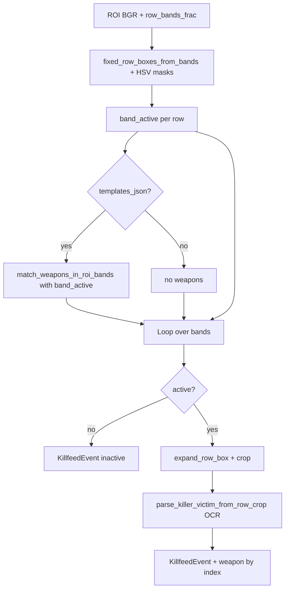

# Unified killfeed parse (nicknames + weapons)

This document describes the **main parsing path** that extracts **killer / victim** (OCR) and **weapon** (templates in the killfeed strip), how it differs from the live tracker, and how to embed it in a prototype or service.

Code: [`parse_killfeed.py`](../parse_killfeed.py). Weapon matching details: [`docs/WEAPON_MATCHING.md`](WEAPON_MATCHING.md).

---

## 1. Why a separate “unified” parser?

| | **Live tracker** [`valorant_killfeed_tracker.py`](../valorant_killfeed_tracker.py) | **Unified parse** [`parse_killfeed.py`](../parse_killfeed.py) |
|---|--------------------------------|-------------------------------------|
| Input | Screen frame, contour rows, event cache | Static image, bytes, or array |
| Weapon on `KillfeedEvent` | Usually **no** (`process_frame` events without weapon fields) | **Yes**, when templates are enabled |
| Row geometry | HSV contours **or** fixed bands (`row_bands_frac`) | Always **fixed bands** from JSON (aligned with `match_killfeed_weapon.py`) |
| EasyOCR | Fast **stacked** path: multiple rows in one `readtext` | **Sequential** OCR on active bands (per module docs) |

The unified parser targets **one call → full row snapshot** for screenshots, tests, backends, or batch jobs where you want nicknames and weapon in a single object.

---

## 2. Entry points

### 2.1 `parse_killfeed_image` — main API for prototypes

```python
from dataclasses import asdict
from parse_killfeed import parse_killfeed_image

events = parse_killfeed_image("path/to/screenshot.png")
# or: bytes from the network, or BGR np.ndarray H×W×3
for e in events:
    print(e.killer, "->", e.victim, e.weapon, e.active)
payload = [asdict(e) for e in events]  # JSON-friendly
```

**What it does internally (short):**

1. Optionally overrides `REGION_KILLFEED` temporarily (`killfeed_rect`).
2. Decodes the image (file / bytes / ndarray).
3. Warms the OCR session (EasyOCR) when `warm_ocr=True`.
4. Crops killfeed: `crop_killfeed_region_if_possible` (full frame → strip from constants).
5. Calls **`parse_killfeed_roi_unified`** on the ROI.
6. Applies **`omit_inactive_if_count_ge`** to optionally drop inactive bands from the returned list (see §5).

**Important:** the function **does not write** to disk (no JSON, no debug PNG). It only **reads** configs and, when given a path, the image file.

### 2.2 `parse_killfeed_roi_unified` — lower level

If you already have a **BGR killfeed ROI** (not the full frame) and a `bands` list from `load_row_bands_json`, call this directly. Returns a tuple:

- `events` — list of `KillfeedEvent`
- `boxes` — band geometry
- `masks` — green / red HSV masks (for debugging)
- `band_active` — whether each band is treated as live
- `weapon_hits` — raw weapon matcher hits or `None`

Optionally **`timings_out`**: keys `setup_ms`, `weapons_ms`, `ocr_ms`, `total_ms` (see [`benchmark_parse_killfeed.py`](../benchmark_parse_killfeed.py)).

### 2.3 CLI `python parse_killfeed.py`

Handy for manual checks: writes `killfeed_parse.json`, optional `--print-json` / `--no-write`, `--debug-out`, `--omit-inactive-bands`. Dropping inactive rows in the CLI works **differently** than in `parse_killfeed_image` (see §5).

---

## 3. Pipeline inside `parse_killfeed_roi_unified`



**Phase order (for timing):**

1. **Setup** — band boxes, masks, `band_active`.
2. **Weapons** — one matching pass over the ROI and bands (inactive bands skipped).
3. **OCR** — **active** bands only; inactive bands get an event without OCR or weapon.

Weapon and OCR therefore share the **same** row geometry (fixed fractions of ROI height).

---

## 4. Data model: `KillfeedEvent`

Fields (see [`valorant_killfeed_tracker.py`](../valorant_killfeed_tracker.py)):

| Field | Meaning |
|------|--------|
| `killer`, `victim` | After OCR; may be `"?"` if the row is active but text failed |
| `row_color` | `"green"` / `"red"` for an active row; `"inactive"` for an empty band |
| `probable_enemy_kill` | `True` if `row_color == "red"` |
| `raw_left`, `raw_right` | Raw OCR strings left / right |
| `t` | Timestamp (`now`) passed into the parser |
| `weapon` | Weapon id from the template JSON, or `None` |
| `weapon_score`, `weapon_margin`, `weapon_vs` | Match quality, margin to runner-up, runner-up id |
| `row_band_index` | Band index (0 = top row in config) |
| `active` | `False` — band lacks enough green/red highlight (empty slot over the map) |

API serialization: `dataclasses.asdict(event)`.

---

## 5. Inactive bands: two modes

**In the library (`parse_killfeed_image`):** if the number of inactive rows is **≥ `omit_inactive_if_count_ge`** (default **2**), the result contains **only** `active=True` events. If at most one band is inactive, **all** bands are returned (so you do not lose a single empty slot between two kills). For a fixed-length list equal to the number of bands in JSON, use **`omit_inactive_if_count_ge=None`**.

**In the CLI (`parse_killfeed.py`):** **`--omit-inactive-bands`** writes only active rows to JSON (“drop every inactive band”, no “2+” threshold).

HSV thresholds: **`--min-band-highlight-px`** / **`--min-band-highlight-frac`** (defaults in code match the CLI).

---

## 6. Configuration

- **`config/killfeed_row_bands.json`** — `row_bands_frac`: vertical bands inside the ROI.
- **`config/weapon_templates.json`** — map “weapon name → PNG path” (templates usually under [`assets/icons/`](../assets/icons/)).

The same band JSON is used by the weapon matcher script, so text and icon alignment stays consistent.

---

## 7. Using this in a prototype

Typical patterns:

1. **HTTP service** — request body = PNG/JPEG bytes → `parse_killfeed_image(image_bytes)` → JSON from `asdict`.
2. **Screenshot queue** — file under `temp/screenshots/` → same call with `Path`.
3. **No weapons** — `weapons_enabled=False` (faster, no template dependency).
4. **Custom ROI on a full frame** — `killfeed_rect=(top, left, width, height)` in monitor coordinates, same idea as the tracker.
5. **Tuning speed** — `ocr_engine="tesseract"`, `warm_ocr=False` in a loop after the first warm-up; or `timings_out={}` for profiling.

A live overlay on **`process_frame`** can converge on a shared event model either by adding weapon matching inside the tracker or by using **`parse_killfeed_image`** as the source of truth for snapshots (“nickname + weapon”).

---

## 8. Related files

**Project-wide stack record:** [`TECH_STACK.md`](TECH_STACK.md).

| File | Role |
|------|------|
| [`parse_killfeed.py`](../parse_killfeed.py) | `parse_killfeed_image`, `parse_killfeed_roi_unified`, CLI |
| [`scripts/match_killfeed_weapon.py`](../scripts/match_killfeed_weapon.py) | Per-band weapon matching |
| [`docs/WEAPON_MATCHING.md`](WEAPON_MATCHING.md) | NCC algorithm, thresholds, white slot |
| [`benchmark_parse_killfeed.py`](../benchmark_parse_killfeed.py) | Full-pipeline benchmark |

---

*If you change `row_bands_frac`, resolution, or the killfeed region, re-check band activity and OCR quality on representative PNGs in [`assets/screenshots/`](../assets/screenshots/).*
